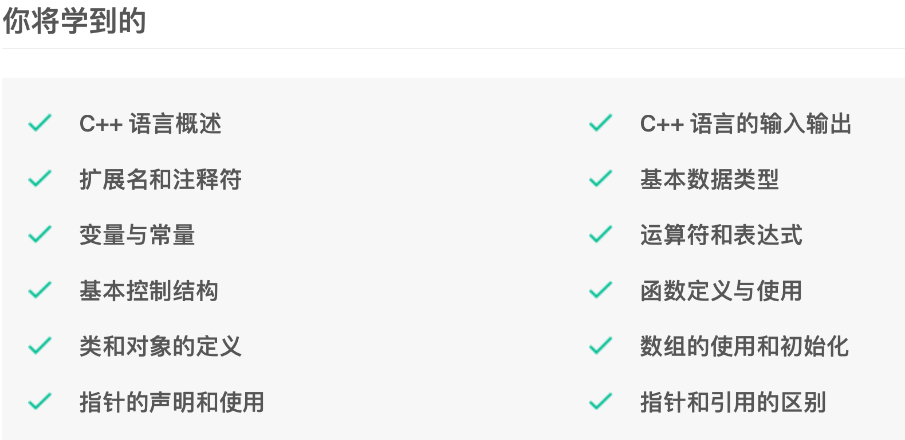
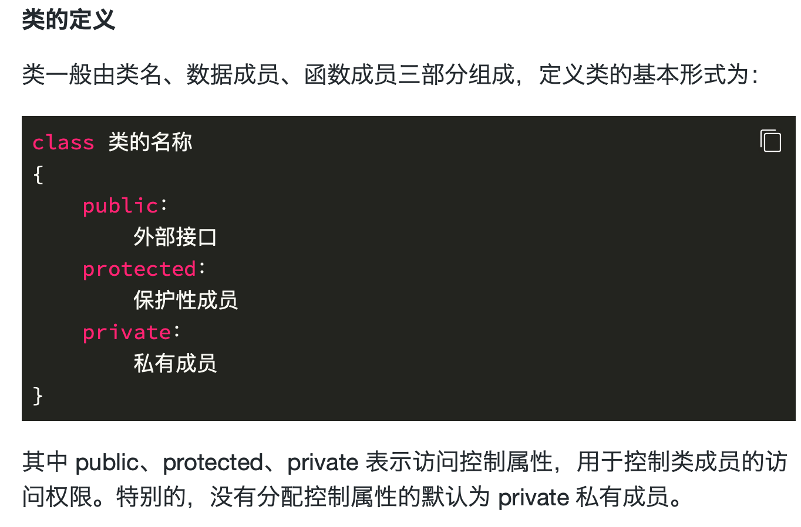

C 语言是面向过程的程序设计语言，而 C++ 语言是由 C 语言演变而来的一种面向对象的程序设计语言。课程实验内容从 C++ 语言的概念开始，通过理论学习和实验操作，初步熟知 C++ 语言。

#### 类成员访问控制

使用 **public** 关键字声明的公有成员可在类外访问，即公有类型成员定义了外部接口。例如pubtest.cpp

使用 **protected** 关键字声明的受保护成员可在子类中访问。例如 protest.cpp

使用 **private** 关键字声明的私有成员只能被本类的成员函数访问。例如 pritest.cpp
